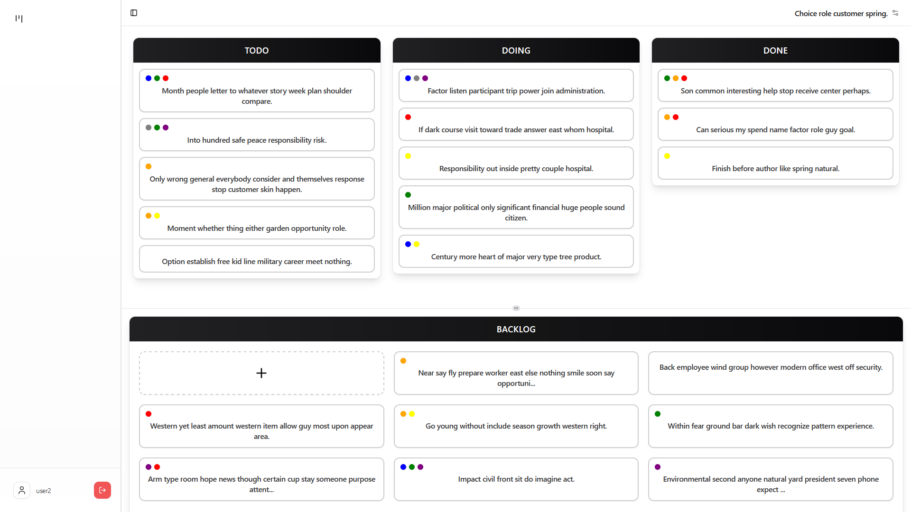
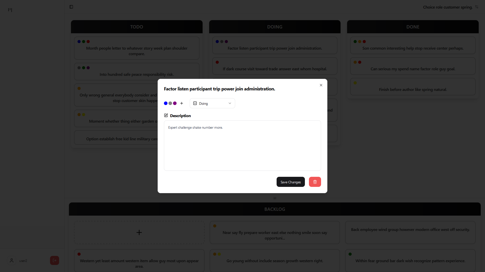
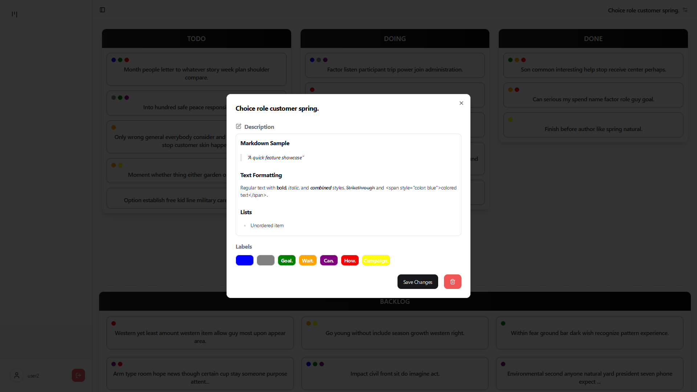

# Simple Kanban

A modern, full-stack Kanban board application built to demonstrate software engineering best practices.

## Overview

Simple Kanban is a task management system built with FastAPI and Next.js, showcasing clean architecture and modern development practices. It implements core Kanban methodology features while maintaining simplicity and performance.

## Key Features

- **Modern Authentication:** JWT-based auth flow with secure session management
- **Real-Time Updates:** Optimistic UI updates for seamless user experience
- **Clean Architecture:** Clear separation of concerns with FastAPI and Next.js
- **Efficient Data Model:** SQLAlchemy ORM with proper relationship modeling
- **AI Integration:** Model Context Protocol (MCP) for LLM tool calling capabilities

## Tech Stack

- **Frontend:** Next.js, TypeScript, Tailwind CSS, shadcn/ui
- **Backend:** FastAPI, SQLAlchemy, PostgreSQL
- **Infrastructure:** Docker
- **Testing:** Pytest for API testing
- **CI/CD:** GitHub Actions

## Project Structure

```
.
├── backend/         # FastAPI server with SQLAlchemy ORM
├── frontend/        # Next.js client application
├── mcp/             # Model Context Protocol for LLM integration
└── scripts/         # Development utilities
```

## Screenshots




_A minimalist Kanban interface with four columns (Backlog, Todo, Doing, Done) to reduce decision effort. Cards feature titles, descriptions, and a curated set of label colors._

## Getting Started

### Quick Start with Docker

```bash
# Clone the repository
git clone https://github.com/mateo-velez/simple-kanban.git
cd simple-kanban

# Launch services
docker compose up -d
```

Access the application:

- Web UI: http://localhost:8000
- API Docs: http://localhost:8000/docs

### Development Setup

Prerequisites:

- Python 3.10+
- Node.js 18+
- PostgreSQL 15

1. Backend Setup:

```bash
cd backend
python -m venv venv
source venv/bin/activate  # Windows: .\venv\Scripts\activate
pip install -e .[dev]
fastapi run src/kanban_api/main.py
```

2. Frontend Setup:

```bash
cd frontend
npm install
npm run dev
```

## Technical Highlights

- **Backend:**

  - RESTful API with FastAPI and async operations
  - SQLAlchemy ORM with proper relationship modeling
  - Comprehensive API testing with pytest
  - JWT authentication flow

- **Frontend:**
  - Client-side rendering with Next.js
  - Type-safe development with TypeScript
  - Optimistic updates for better UX
  - Responsive design with Tailwind CSS

## Planned Enhancements

- Database migrations with Alembic
- Enhanced logging system
- Drag-and-drop card functionality
- Frontend chat integration
- Board sharing implementation
- User analytics dashboard

## License

This project is licensed under the MIT License - see the LICENSE file for details.
