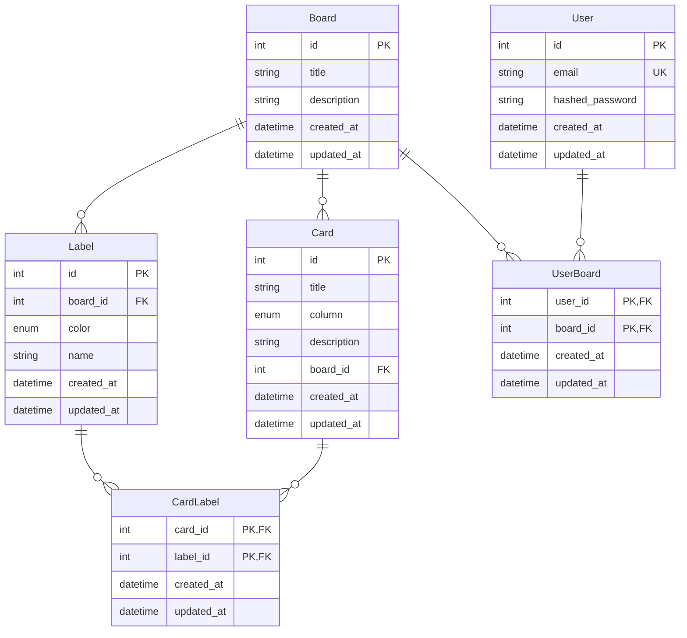

# Backend

## Overview

I developed this backend service as a RESTful API to power a Kanban board application. The implementation showcases modern Python development practices and industry-standard architectural patterns.

### Key Features

- RESTful API with comprehensive CRUD operations
- JWT-based authentication and authorization
- Multi-user board sharing capabilities
- Efficient database operations with SQLAlchemy ORM
- Comprehensive test coverage

### Technology Stack

| Component            | Choice     | Justification                                                                      |
| -------------------- | ---------- | ---------------------------------------------------------------------------------- |
| Framework            | FastAPI    | Fast to develop with, automatic OpenAPI docs, built-in request/response validation |
| ORM                  | SQLAlchemy | Familiar with it, great async support, type hints in v2.0 speed up development     |
| Production Database  | PostgreSQL | Production ready, good async driver support with asyncpg                           |
| Development Database | SQLite     | Simple to set up, perfect for local development                                    |
| Testing Framework    | Pytest     | Simple to write tests, great fixture system                                        |
| Task Automation      | Nox        | Simple to set up, isolates task environments                                       |
| Package Management   | Poetry     | Modern tool, handles dependencies well, clear dependency specification             |
| Code Quality         | Ruff+Black | Fast linting and formatting, good defaults                                         |

## Architecture

### Project Structure

The backend follows a modular structure for maintainability and separation of concerns:

```text
kanban_api/
├── config.py          # Environment and app configuration
├── database.py        # Database connection and session management
├── dependencies.py    # FastAPI dependency injection (auth, current user)
├── models/           # SQLAlchemy ORM models
│   ├── board.py     # Board model and relationships
│   ├── card.py      # Card model and relationships
│   └── user.py      # User model and auth-related methods
├── routes/           # API endpoints grouped by resource
│   ├── auth.py      # Authentication endpoints
│   ├── boards.py    # Board management
│   ├── cards.py     # Card operations
│   └── users.py     # User management
├── schemas/          # Pydantic models for validation
│   ├── board.py     # Board request/response schemas
│   ├── card.py      # Card request/response schemas
│   └── user.py      # User request/response schemas
└── utils/           # Shared utilities
    ├── password.py  # Password hashing
    └── token.py     # JWT token handling
```

### Data Model



## Technical Implementation

### Authentication & Security

I implemented a security system focusing on:

- **Password Security**: Bcrypt hashing with salt for secure credential storage (using passlib)
- **JWT Authentication**: 1-hour access tokens
- **Protected Routes**: FastAPI dependency injection for authorization checks

Here's how the authentication flow works:

1. **Password Handling**:

```python
# Using industry-standard bcrypt for password hashing
pwd_context = CryptContext(schemes=["bcrypt"], deprecated="auto")

def verify_password(plain_password: str, hashed_password: str) -> bool:
    return pwd_context.verify(plain_password, hashed_password)
```

2. **Token Generation & Validation**:

```python
# Tokens expire after 1 hour and contain user ID and email
@router.post("/auth/tokens", status_code=200)
def login(form_data: OAuth2PasswordRequestForm = Depends(), db: Session = Depends(get_db)) -> Token:
    # Validate credentials
    user = db.execute(select(User).where(User.email == form_data.username)).scalar_one_or_none()
    if not user or not verify_password(form_data.password, user.hashed_password):
        raise HTTPException(status_code=401)

    # Generate JWT token
    token_data = TokenData(sub=str(user.id), email=user.email)
    access_token = create_access_token(
        token_data,
        expires_delta=timedelta(hours=1)
    )
    return Token(access_token=access_token, token_type="bearer")
```

3. **Route Protection**:

```python
def get_current_user(
    token: str = Depends(oauth2_scheme),
    db: Session = Depends(get_db)
) -> User:
    try:
        # Decode and validate token
        token_data = decode_access_token(token)
        if not token_data:
            raise InvalidTokenError

        # Get user from database
        user = db.execute(
            select(User).where(User.id == int(token_data.sub))
        ).scalar_one_or_none()

        if not user:
            raise InvalidTokenError
        return user
    except InvalidTokenError:
        raise HTTPException(
            status_code=401,
            detail="Could not validate credentials",
            headers={"WWW-Authenticate": "Bearer"},
        )
```

### Database Operations

<!-- THe benefit of sqlalchemy is in the IDE, type hints are HUGELY beneficial, besides SQLALCHEM ORM 2.0 style is the recommended style -->

I chose SQLAlchemy 2.0 because its modern style provides clear type hints and makes database interactions more straightforward:

```python
class Board(Base, TimestampMixin):
    __tablename__ = "board"

    id: Mapped[int] = mapped_column(Identity(), primary_key=True)
    title: Mapped[str] = mapped_column(nullable=False)
    description: Mapped[str] = mapped_column(nullable=True)

    # Relationships with cascading deletes
    cards: Mapped[list["Card"]] = relationship(
        cascade="all, delete-orphan",
        back_populates="board"
    )
    owners: Mapped[list["User"]] = relationship(
        secondary="users_boards",
        back_populates="boards"
    )
```

### API Design

The API endpoints were designed with the following goals:

- Be simple and easy to understand
- Adhere to RESTful principles
- Use appropriate HTTP methods
- Return meaningful status codes

| Method | Endpoint                               | Description          |
| ------ | -------------------------------------- | -------------------- |
| POST   | /api/auth/tokens                       | Login                |
| POST   | /api/users                             | Create user          |
| GET    | /api/users/me                          | Get current user     |
| PATCH  | /api/users/me                          | Update current user  |
| POST   | /api/users/search                      | Search user by email |
| GET    | /api/boards                            | List boards          |
| POST   | /api/boards                            | Create board         |
| GET    | /api/boards/{board_id}                 | Get board            |
| DELETE | /api/boards/{board_id}                 | Delete board         |
| PATCH  | /api/boards/{board_id}                 | Update board         |
| POST   | /api/boards/{board_id}/cards           | Create cards         |
| GET    | /api/boards/{board_id}/cards           | List cards           |
| PUT    | /api/boards/{board_id}/users/{user_id} | Share board          |
| DELETE | /api/boards/{board_id}/users/{user_id} | Unshare board        |
| GET    | /api/boards/{board_id}/users           | List board users     |
| GET    | /api/cards/{card_id}                   | Get card             |
| PATCH  | /api/cards/{card_id}                   | Update card          |
| DELETE | /api/cards/{card_id}                   | Delete card          |

## Development & Operations

### Testing Strategy

I implemented a comprehensive testing approach:

```python
@pytest.fixture(scope="session")
async def auth_client(client: AsyncClient) -> AsyncClient:
    """Provides an authenticated client for testing protected endpoints."""
    user_data = {"email": "test@example.com", "password": "testpass123"}
    await client.post("/api/users", json=user_data)
    response = await client.post("/api/auth/tokens", data=user_data)
    token = response.json()["access_token"]
    client.headers["Authorization"] = f"Bearer {token}"
    return client

async def test_create_board(auth_client: AsyncClient):
    """Test board creation with authentication."""
    response = await auth_client.post(
        "/api/boards",
        json={"title": "Test Board", "description": "Test Description"}
    )
    assert response.status_code == 201
    data = response.json()
    assert data["title"] == "Test Board"
```

### CI/CD Pipeline

The project uses GitHub Actions for automation:

**CI Pipeline**

- Runs on pull requests to main branch
- Builds and runs tests in Docker container

**CD Pipeline**

- Triggers on push to main branch
- Builds frontend static files
- Builds and pushes Docker image to Docker Hub

## Technical Challenges & Solutions

### CRUD Operations

<!--
The point is that to do efficient CRUD you MUST understand
the underlying ORM workings,

To do this you read the docs, and debug the sqlalchemy queries.


So even though the ORM is a black box, you need to understand it.


/ -->

When working with SQLAlchemy, I quickly realized that understanding the ORM's internals was crucial for efficient database operations. Simply using the ORM as a black box wasn't enough.

I spent significant time reading documentation and debugging SQL queries to truly understand how SQLAlchemy translates Python code into database operations. This deep dive helped me:

- Optimize query performance
- Implement more efficient database relationships
- Gain insights into how the ORM handles complex data interactions

### Testing Setup

<!--
The challenge here is that pyenv session DO NOT reload imports, module imports are cached. So for example, if you import the main.py under certain env variables, that will be cached and used for all tests, even if you change the scope of the test.

TOgether with the fact that pytest fixtures under the session scope are close to per module, so one may think that is per pytest run but no, they are per module.

So i had to define a single env variables in the __init__.py file, and then use that in the tests.

 -->

Testing presented unexpected challenges with Python's import caching and fixture scoping. I discovered that module imports can be cached across test sessions, which means environment variables and configurations might not reset as expected.

To solve this, I:

- Carefully managed environment variables in `__init__.py`
- Created more robust fixture scoping strategies
- Developed reusable fixtures that could reliably set up test databases and authentication

### Async Implementation

<!--
I tried to implement the api as async, but it was not easy, and i had to refactor a lot and the dev cost increased a lot. So I opted for sync.

 -->

I initially attempted to implement an async API, but the complexity and refactoring effort quickly became prohibitive. The development cost of maintaining a fully async implementation outweighed the potential performance benefits.

After careful consideration, I decided to use a synchronous approach, which simplified the codebase and made the implementation more maintainable.

## Future Improvements

Based on the current implementation, here are planned enhancements:

**API Enhancements**

- Implement board activity logging
- Add user roles and permissions (admin, member, viewer)
- Support card and comments

**Security Enhancements**

- Implement rate limiting for auth endpoints

**Database Improvements**

- Add database migrations using Alembic
- Implement soft deletes for boards and cards

## Demos and Screenshots


_Auto-generated API documentation showing available endpoints_
