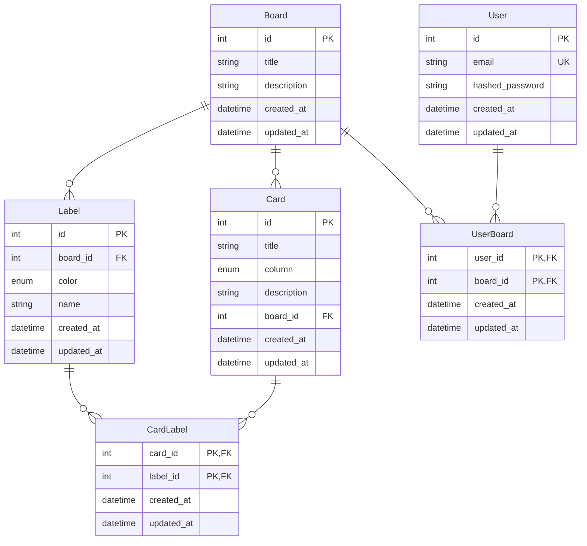
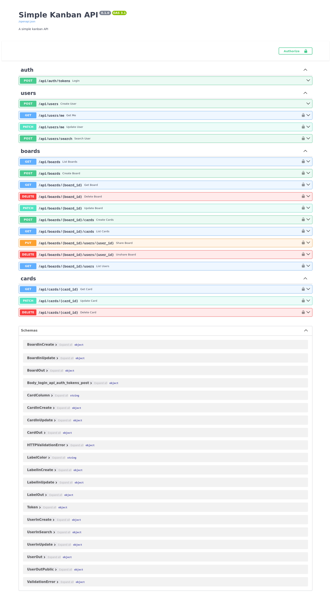

# Backend

## Overview

### Project Structure

```text
.
├── Dockerfile                      // Docker configuration
├── kanban_api/                     // Main application
│  ├── __init__.py
│  ├── config.py                   // Application config
│  ├── database.py                 // Database setup
│  ├── dependencies.py             // FastAPI dependencies
│  ├── main.py                     // FastAPI entrypoint
│  ├── models.py                   // Database models
│  ├── routes/                     // API routes
│  ├── schemas/                    // Data schemas
│  └── utils/                      // Utility functions
├── noxfile.py                      // Nox config
├── poetry.lock                     // Dependency lock file
├── pyproject.toml                  // Project config
├── README.md
├── static/                         // Static files
└── tests/                          // Test suite
   ├── __init__.py
   ├── conftest.py                 // Pytest config
   ├── routes/                     // Route tests
   └── utils/                      // Utility tests
```

### Data Models



### API

The API endpoints were designed with the following goals:

- Be simple and easy to understand.
- Adhere to RESTful API principles.
- Provide endpoints for common operations.
- Use appropriate HTTP method verbs.
- Return appropriate HTTP status codes.

| Method | Endpoint                               | Description          |
| ------ | -------------------------------------- | -------------------- |
| POST   | /api/auth/tokens                       | Login                |
| POST   | /api/users                             | Create user          |
| GET    | /api/users/me                          | Get current user     |
| PATCH  | /api/users/me                          | Update current user  |
| POST   | /api/users/search                      | Search user by email |
| GET    | /api/boards                            | List boards          |
| POST   | /api/boards                            | Create board         |
| GET    | /api/boards/{board_id}                 | Get board            |
| DELETE | /api/boards/{board_id}                 | Delete board         |
| PATCH  | /api/boards/{board_id}                 | Update board         |
| POST   | /api/boards/{board_id}/cards           | Create cards         |
| GET    | /api/boards/{board_id}/cards           | List cards           |
| PUT    | /api/boards/{board_id}/users/{user_id} | Share board          |
| DELETE | /api/boards/{board_id}/users/{user_id} | Unshare board        |
| GET    | /api/boards/{board_id}/users           | List owners          |
| GET    | /api/cards/{card_id}                   | Get card             |
| PATCH  | /api/cards/{card_id}                   | Update card          |
| DELETE | /api/cards/{card_id}                   | Delete card          |

### Style Choices

- Model attribute names use `snake_case` (e.g., `board_id`).
- SQLAlchemy ORM 2.0 style is used for defining models.

  ```python
  class Board(Base, TimestampMixin):
      __tablename__ = "board"

      id: Mapped[int] = mapped_column(Identity(), primary_key=True)
      title: Mapped[str] = mapped_column(nullable=False)
      description: Mapped[str] = mapped_column(nullable=True)

      # Relationships
      cards: Mapped[list["Card"]] = relationship(
          "Card", back_populates="board", cascade="all, delete-orphan"
      )
      owners: Mapped[list["User"]] = relationship(
          "User", secondary="users_boards", back_populates="boards"
      )
      labels: Mapped[list["Label"]] = relationship(
          "Label", back_populates="board", cascade="all, delete-orphan"
      )
  ```

- Type hints are used in FastAPI route definitions for response models.

  ```python
  @router.get("/{board_id}", status_code=200)
  def get_board(board: Board = Depends(get_board)) -> BoardOut:
      return board
  ```

### Technologies

| Component             | Technology | Reasons                                                                                                      |
| --------------------- | ---------- | ------------------------------------------------------------------------------------------------------------ |
| Framework             | FastAPI    | Good community support, excellent documentation, Pydantic models, rapid development, auto-generated api docs |
| ORM                   | SQLAlchemy | De facto standard for ORM in Python                                                                          |
| Database              | PostgreSQL | Comfortable and reliable for production                                                                      |
| Dev Database          | SQLite     | easy to use for development                                                                                  |
| Testing               | Pytest     | De facto standard for testing in Python, simple to use                                                       |
| Automation            | Nox        | Simple and easy to use for task automation, need consistent run with CI/CD                                   |
| Dependency Management | Poetry     | Simple, intuitive dependency management and packaging                                                        |

<!-- ## Problems Faced

## Learned Lessons -->

## Demos and Screenshots


