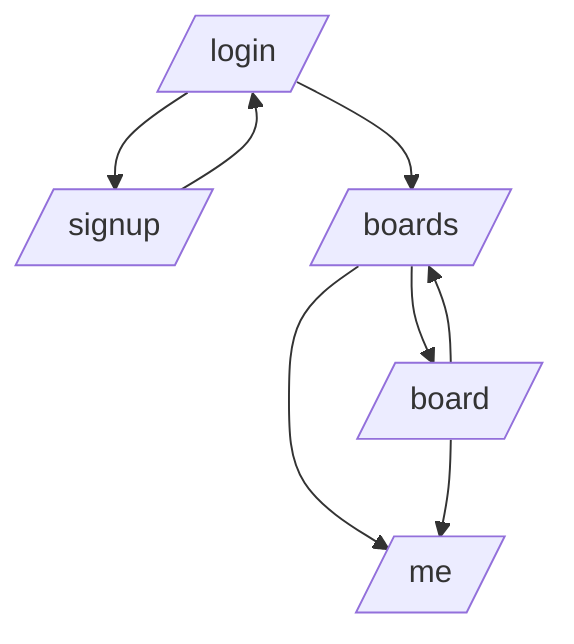

# Frontend

## Overview

I aimed at building a static webpage for a Kanban board API, using an aesthetically pleasing interface and simple development approach.

### Project Structure

```text
.
├── src/                           // Source code
│   ├── app/                      // Next.js app router pages
│   ├── api-client/               // Auto-generated API client
│   ├── auth/                     // Authentication related code
│   ├── components/               // Reusable UI components
│   ├── hooks/                    // Custom React hooks
│   └── lib/                      // Utility functions and configs
├── public/                        // Static assets
└── config files                  // Various configuration files
```

### Technologies

| Component     | Technology        | Reasons                                                    |
| ------------- | ----------------- | ---------------------------------------------------------- |
| Framework     | Next.js 15        | De facto React framework, simple development, great DX     |
| Language      | TypeScript        | Type safety, better development experience                 |
| Styling       | Tailwind CSS      | Utility-first CSS, rapid development                       |
| UI Components | Shadcn UI         | Beautiful components, easy to customize, built on Radix UI |
| API Client    | OpenAPI Generator | Type-safe API client from OpenAPI specs                    |

### Key Features

- Static webpage with modern React and Next.js
- Clean and aesthetic UI with Shadcn UI components
- Type-safe development with TypeScript
- Auto-generated API client
- Responsive design with Tailwind CSS

### Problems Faced

We couldn't generate static pages when using dynamic routing `/board/[id]`. Instead, we opted for using query parameters on the client side `/board/?board_id=[id]`.

### Routing Structure



#### Pages

- **/login**

  - User authentication page
  - Entry point for existing users
  - Redirects to boards after successful login

- **/signup**

  - New user registration
  - Collects email and password
  - Redirects to login after successful registration

- **/boards** _Home page_

  - Main dashboard showing all user's boards
  - Create new boards
  - Access to existing boards
  - Navigation to user profile

- **/board/?board_id=[id]**

  - Individual board view
  - Shows cards and columns
  - Manage board content
  - Navigate back to boards list

- **/me**
  - User profile page
  - View and edit user information
  - Accessible from any authenticated page

## Demo/Screenshots


