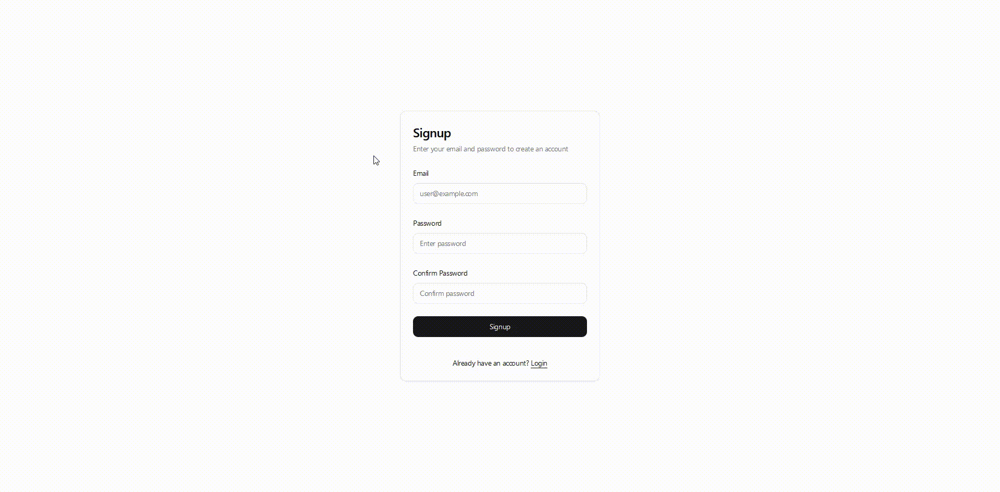

# Simple Kanban

A showcase full-stack Kanban board application built with modern technologies and best practices, featuring AI integration for task management. [Repo](https://github.com/mateo-velez/simple-kanban)

## Project Goals

This project demonstrates:

- Full-stack development capabilities using modern technologies
- Implementation of agile practices and SMART goals
- AI integration for enhanced task management
- Clean, maintainable code with comprehensive testing

## Core Design Principles

### Simplicity & Focus

- Four essential columns: Backlog, Todo, Doing, and Done
- Seven carefully chosen label colors
- Streamlined board and card details to maintain task focus

### User Experience

- Clean, intuitive frontend design
- Aesthetically pleasing interface
- Easy to implement and maintain

### AI Integration (MCP)

The Model Context Protocol (MCP) integration enables AI-powered features through:

- API integration for AI interactions
- CRUD operations on boards and cards through AI tools
- Enhanced task management capabilities

## Component Documentation

Explore detailed documentation for each component:

[Backend](backend.md) - FastAPI-powered REST API with comprehensive CRUD operations

[Frontend](frontend.md) - Modern Next.js application with clean UI/UX

[MCP](mcp.md) - AI integration layer for enhanced functionality

## Project Demo

